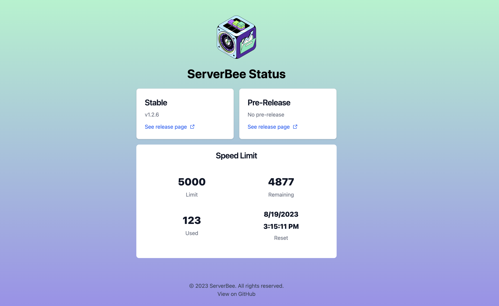

# ServerBee Status

Serverless status api for ServerBee.

## API

### GET /version
curl https://status.serverbee.app/version

response:
```bash
v1.2.6
```

### GET /pre-version
curl https://status.serverbee.app/pre-version

response:
```bash
v1.2.6
```

## Development

Make sure to install Deno: https://deno.land/manual/getting_started/installation

Then start the project:

```
deno task start
```

## Snapshot


